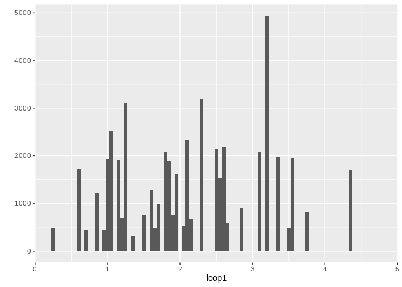

## Summary

Following work is an analysis of herrings dataset. Our assignment was to find what causes herrings to became shorter and shorter over time. Analysis contains a survey of attributes, dealing with missing values, inspecting correlations between values, value transformation and normalization. Everything finished with regression and checking for the most important attribute, which turned out to be a `sea surface temperature` attribute.

## Used Packages

Loading libaries:

```r
library(RCurl)
library(dplyr)
library(readr)
library(tidyr)
library(stringr)
library(knitr)
library(kableExtra)
library(mice)
library(VIM)
library(e1071)
library(ggplot2)
library(corrplot)
library(plotly)
library(caret)
library(doMC)
library(xgboost)
```

Listing of libraries loaded during code execution can be found in the cell below:

```
## [1] "minqa, class, rio, rstudioapi, prodlim, lubridate, ranger, xml2, codetools, splines, robustbase, zeallot, jsonlite, nloptr, broom, compiler, httr, backports, assertthat, Matrix, lazyeval, htmltools, tools, gtable, glue, reshape2, Rcpp, carData, cellranger, vctrs, nlme, lmtest, timeDate, xfun, gower, laeken, openxlsx, lme4, rvest, lifecycle, pan, DEoptimR, MASS, zoo, scales, ipred, hms, yaml, curl, rpart, stringi, boot, zip, lava, rlang, pkgconfig, evaluate, purrr, recipes, htmlwidgets, tidyselect, plyr, magrittr, R6, generics, mitml, pillar, haven, foreign, withr, survival, abind, sp, nnet, tibble, crayon, car, jomo, rmarkdown, readxl, forcats, ModelMetrics, vcd, digest, webshot, stats4, munsell, viridisLite"
```
## Loading Data

Data is loded accoring to the metadata provided in the `params` object, where a location of a dataset (both local and url) is provided. Mentioned object contains also information about expected form of missing data. In this case 

```r
if(file.exists(params$dataset_name)) {
  dataset <- read.csv(params$dataset_name, na.strings = params$na_chars)
} else if(url.exists(params$dataset_url)){
  download.file(params$dataset_url, params$dataset_name)
  dataset <- read.csv(params$dataset_name, na.strings = params$na_chars)
} else {
  stop("There is no file nor url resource to work with!")
}
```

## Dataset

To see dimensionality we've used `dim` function:

```r
dim(dataset)
```

```
## [1] 52582    16
```
There are 52582 row and 16 columns.

Here are names of all columns available in a raw dataset:

```r
dataset %>%
  colnames %>%
  print
```

```
##  [1] "X"      "length" "cfin1"  "cfin2"  "chel1"  "chel2"  "lcop1" 
##  [8] "lcop2"  "fbar"   "recr"   "cumf"   "totaln" "sst"    "sal"   
## [15] "xmonth" "nao"
```

First sight at some rows from dataset will help us get better view on the data.

```r
head(dataset) %>%
  kable("html") %>%
  kable_styling(bootstrap_options = c('striped', 'hover')) %>%
  scroll_box(width = '100%')
```

<div style="border: 1px solid #ddd; padding: 5px; overflow-x: scroll; width:100%; "><table class="table table-striped table-hover" style="margin-left: auto; margin-right: auto;">
 <thead>
  <tr>
   <th style="text-align:right;"> X </th>
   <th style="text-align:right;"> length </th>
   <th style="text-align:right;"> cfin1 </th>
   <th style="text-align:right;"> cfin2 </th>
   <th style="text-align:right;"> chel1 </th>
   <th style="text-align:right;"> chel2 </th>
   <th style="text-align:right;"> lcop1 </th>
   <th style="text-align:right;"> lcop2 </th>
   <th style="text-align:right;"> fbar </th>
   <th style="text-align:right;"> recr </th>
   <th style="text-align:right;"> cumf </th>
   <th style="text-align:right;"> totaln </th>
   <th style="text-align:right;"> sst </th>
   <th style="text-align:right;"> sal </th>
   <th style="text-align:right;"> xmonth </th>
   <th style="text-align:right;"> nao </th>
  </tr>
 </thead>
<tbody>
  <tr>
   <td style="text-align:right;"> 0 </td>
   <td style="text-align:right;"> 23.0 </td>
   <td style="text-align:right;"> 0.02778 </td>
   <td style="text-align:right;"> 0.27785 </td>
   <td style="text-align:right;"> 2.46875 </td>
   <td style="text-align:right;"> NA </td>
   <td style="text-align:right;"> 2.54787 </td>
   <td style="text-align:right;"> 26.35881 </td>
   <td style="text-align:right;"> 0.356 </td>
   <td style="text-align:right;"> 482831 </td>
   <td style="text-align:right;"> 0.3059879 </td>
   <td style="text-align:right;"> 267380.8 </td>
   <td style="text-align:right;"> 14.30693 </td>
   <td style="text-align:right;"> 35.51234 </td>
   <td style="text-align:right;"> 7 </td>
   <td style="text-align:right;"> 2.8 </td>
  </tr>
  <tr>
   <td style="text-align:right;"> 1 </td>
   <td style="text-align:right;"> 22.5 </td>
   <td style="text-align:right;"> 0.02778 </td>
   <td style="text-align:right;"> 0.27785 </td>
   <td style="text-align:right;"> 2.46875 </td>
   <td style="text-align:right;"> 21.43548 </td>
   <td style="text-align:right;"> 2.54787 </td>
   <td style="text-align:right;"> 26.35881 </td>
   <td style="text-align:right;"> 0.356 </td>
   <td style="text-align:right;"> 482831 </td>
   <td style="text-align:right;"> 0.3059879 </td>
   <td style="text-align:right;"> 267380.8 </td>
   <td style="text-align:right;"> 14.30693 </td>
   <td style="text-align:right;"> 35.51234 </td>
   <td style="text-align:right;"> 7 </td>
   <td style="text-align:right;"> 2.8 </td>
  </tr>
  <tr>
   <td style="text-align:right;"> 2 </td>
   <td style="text-align:right;"> 25.0 </td>
   <td style="text-align:right;"> 0.02778 </td>
   <td style="text-align:right;"> 0.27785 </td>
   <td style="text-align:right;"> 2.46875 </td>
   <td style="text-align:right;"> 21.43548 </td>
   <td style="text-align:right;"> 2.54787 </td>
   <td style="text-align:right;"> 26.35881 </td>
   <td style="text-align:right;"> 0.356 </td>
   <td style="text-align:right;"> 482831 </td>
   <td style="text-align:right;"> 0.3059879 </td>
   <td style="text-align:right;"> 267380.8 </td>
   <td style="text-align:right;"> 14.30693 </td>
   <td style="text-align:right;"> 35.51234 </td>
   <td style="text-align:right;"> 7 </td>
   <td style="text-align:right;"> 2.8 </td>
  </tr>
  <tr>
   <td style="text-align:right;"> 3 </td>
   <td style="text-align:right;"> 25.5 </td>
   <td style="text-align:right;"> 0.02778 </td>
   <td style="text-align:right;"> 0.27785 </td>
   <td style="text-align:right;"> 2.46875 </td>
   <td style="text-align:right;"> 21.43548 </td>
   <td style="text-align:right;"> 2.54787 </td>
   <td style="text-align:right;"> 26.35881 </td>
   <td style="text-align:right;"> 0.356 </td>
   <td style="text-align:right;"> 482831 </td>
   <td style="text-align:right;"> 0.3059879 </td>
   <td style="text-align:right;"> 267380.8 </td>
   <td style="text-align:right;"> 14.30693 </td>
   <td style="text-align:right;"> 35.51234 </td>
   <td style="text-align:right;"> 7 </td>
   <td style="text-align:right;"> 2.8 </td>
  </tr>
  <tr>
   <td style="text-align:right;"> 4 </td>
   <td style="text-align:right;"> 24.0 </td>
   <td style="text-align:right;"> 0.02778 </td>
   <td style="text-align:right;"> 0.27785 </td>
   <td style="text-align:right;"> 2.46875 </td>
   <td style="text-align:right;"> 21.43548 </td>
   <td style="text-align:right;"> 2.54787 </td>
   <td style="text-align:right;"> 26.35881 </td>
   <td style="text-align:right;"> 0.356 </td>
   <td style="text-align:right;"> 482831 </td>
   <td style="text-align:right;"> 0.3059879 </td>
   <td style="text-align:right;"> 267380.8 </td>
   <td style="text-align:right;"> 14.30693 </td>
   <td style="text-align:right;"> 35.51234 </td>
   <td style="text-align:right;"> 7 </td>
   <td style="text-align:right;"> 2.8 </td>
  </tr>
  <tr>
   <td style="text-align:right;"> 5 </td>
   <td style="text-align:right;"> 22.0 </td>
   <td style="text-align:right;"> 0.02778 </td>
   <td style="text-align:right;"> 0.27785 </td>
   <td style="text-align:right;"> 2.46875 </td>
   <td style="text-align:right;"> 21.43548 </td>
   <td style="text-align:right;"> 2.54787 </td>
   <td style="text-align:right;"> NA </td>
   <td style="text-align:right;"> 0.356 </td>
   <td style="text-align:right;"> 482831 </td>
   <td style="text-align:right;"> 0.3059879 </td>
   <td style="text-align:right;"> 267380.8 </td>
   <td style="text-align:right;"> 14.30693 </td>
   <td style="text-align:right;"> 35.51234 </td>
   <td style="text-align:right;"> 7 </td>
   <td style="text-align:right;"> 2.8 </td>
  </tr>
</tbody>
</table></div>
We can see that all available data is numerical. There are some `NA` values. Column `xmonth` should be changed to dummy values before regression.

Names of some columns may be ambiguous. This is their brief explanation:

```
## Dataset contains following attributes:
## - length - length of the fished herring [cm]
## - cfin1 - density of Calanus finmarchicus kat. 1 plankton
## - cfin2 - density of Calanus finmarchicus kat. 2 plankton
## - chel1 - density of Calanus helgolandicus kat. 1 plankton
## - chel2 - density of Calanus helgolandicus kat. 2 plankton
## - lcop1 - density of copepods kat. 1
## - lcop2 - density of copepods kat. 2
## - fbar - intensity of fishing in region [remaining part of herring fry]
## - recr - annual number of herrings
## - cumf - intensity of annual fishing in region [remaining part of herring fry]
## - totaln - number of fished herrings
## - sst - sea surface temperature [Celsius]
## - sal - salinity [Kundsen ppt]
## - xmonth - number of fishing month
## - nao - north atlantic oscillation [mean sea level pressure]
```

After that step, dataset could be transferred to dyplr's `DataFrame` object.
By selecting just columns with `numeric` type and then checking if all column names match those from the raw set, we were able to make sure that all columns are ready for further work.

```r
herrings <- tbl_df(dataset)
herrings %>% 
  select_if(is.numeric) %>%
  colnames
```

```
##  [1] "X"      "length" "cfin1"  "cfin2"  "chel1"  "chel2"  "lcop1" 
##  [8] "lcop2"  "fbar"   "recr"   "cumf"   "totaln" "sst"    "sal"   
## [15] "xmonth" "nao"
```

It was also required to transform `xmonth` column to cathegorical, as its values are numbers of months.

```r
herrings <- herrings %>%
  mutate(xmonth = as.factor(xmonth))
```

## Missing Values
All columns were extracted correctly and do not contain anything different to numeric variables. But there are still missing values (`NA`s) in the dataframe. Before deciding what to do with them it is crucial to know how many rows have `NA` value.

We started with showing the list of columns that have at least one `NA` value.

```r
cols_with_na = c()
for(col in colnames(herrings)){
  if(any(is.na(herrings[col]))){
    cols_with_na <- cols_with_na %>% append(col)
  }
}
cols_with_na
```

```
## [1] "cfin1" "cfin2" "chel1" "chel2" "lcop1" "lcop2" "sst"
```
There are 7 such columns in the herrings dataset. 

Before making any decision about missing data it is important to visualize it. It is recommended to not reconstruct variable if more than 5% of the data is not available. Also it is worth knowing missing data pattern. If it's random it is good idea to try some imputation methods. But if it seems that there is some reason for data being not available it's better to consider other methods (profound analysis of data gathering process is a reasonable way to start).

Following plots contains interesting information about missing data. Their were done using VIM's `aggr` function on dataset with just those columns which contain at least one `NA` value. Left figure, "Histogram of missing data" informs us how many values of each column are missing. We can see that it is around 3% of all values for each column are missing. It is less than mentioned 5% so data reconstruction is worth considering. More than that, as all columns have around 3% missing data it is a first hint that not availability might be caused by some random process. The right-side chart, "Missing data pattern", shows what is the pattern of missing data. All combinations of missing data were captured from the dataset and presented. Red color symbolizes `NA`, while blue indicates that correct value is available. Most common combinations are at the very bottom. Moving to the top there are less and less frequent combinations. 

It seems that there are no strong relations between missing values. Next step is an imputation.

```r
just_with_na <- herrings %>% select(cols_with_na)
aggr_plot <- aggr(just_with_na, col=c('navyblue','red'), numbers=FALSE, bars=TRUE, sortVars=TRUE, labels=names(just_with_na), cex.axis=.8, gap=3, ylab=c("Histogram of missing data","Missing data pattern"))
```

<!-- -->

```
## 
##  Variables sorted by number of missings: 
##  Variable      Count
##     lcop1 0.03143661
##     lcop2 0.03025750
##       sst 0.03012438
##     cfin1 0.03006732
##     chel2 0.02959188
##     chel1 0.02957286
##     cfin2 0.02921152
```

## Imputing Missing Data

In order to reconstruct missing data we've used a `mice` library (Multivariate Imputation By Chained Equations). Seed for a random generator was set to 17. MICE tries to imput values in places of missing data based on the context from other attributes. One of attributes, `sal`, had to be excluded from this step as its participation resulted in error. MICE supports many methods from which it is might be a good idea to choose by first trying its reconstruction results on smaller subsequence of data and compare that to ground truth. We omitted that step and went straight to fairly good `pmm` imputation method. Its name stands for "Predictive Mean Matching.

```r
set.seed(17)
imputed <- mice(herrings,predictorMatrix = quickpred(herrings, exclude = c('sal')), meth='pmm', maxit=1)
```

```
## 
##  iter imp variable
##   1   1  cfin1  cfin2  chel1  chel2  lcop1  lcop2  sst
##   1   2  cfin1  cfin2  chel1  chel2  lcop1  lcop2  sst
##   1   3  cfin1  cfin2  chel1  chel2  lcop1  lcop2  sst
##   1   4  cfin1  cfin2  chel1  chel2  lcop1  lcop2  sst
##   1   5  cfin1  cfin2  chel1  chel2  lcop1  lcop2  sst
```

```r
tmp_data <- complete(imputed,1)
imputed_data <- mutate(tmp_data, sal = herrings$sal)
```

## Attribute-wise Analysis

We started studying attributes by showing their summary which contains basic statistical metrics. There are no missing values as we've got rid of them earlier.

```r
summary(imputed_data) %>%
  kable("html") %>%
  kable_styling(bootstrap_options = c('striped', 'hover')) %>%
  scroll_box(width = '100%')
```

<div style="border: 1px solid #ddd; padding: 5px; overflow-x: scroll; width:100%; "><table class="table table-striped table-hover" style="margin-left: auto; margin-right: auto;">
 <thead>
  <tr>
   <th style="text-align:left;">   </th>
   <th style="text-align:left;">       X </th>
   <th style="text-align:left;">     length </th>
   <th style="text-align:left;">     cfin1 </th>
   <th style="text-align:left;">     cfin2 </th>
   <th style="text-align:left;">     chel1 </th>
   <th style="text-align:left;">     chel2 </th>
   <th style="text-align:left;">     lcop1 </th>
   <th style="text-align:left;">     lcop2 </th>
   <th style="text-align:left;">      fbar </th>
   <th style="text-align:left;">      recr </th>
   <th style="text-align:left;">      cumf </th>
   <th style="text-align:left;">     totaln </th>
   <th style="text-align:left;">      sst </th>
   <th style="text-align:left;">      sal </th>
   <th style="text-align:left;">     xmonth </th>
   <th style="text-align:left;">      nao </th>
  </tr>
 </thead>
<tbody>
  <tr>
   <td style="text-align:left;">  </td>
   <td style="text-align:left;"> Min.   :    0 </td>
   <td style="text-align:left;"> Min.   :19.0 </td>
   <td style="text-align:left;"> Min.   : 0.0000 </td>
   <td style="text-align:left;"> Min.   : 0.0000 </td>
   <td style="text-align:left;"> Min.   : 0.000 </td>
   <td style="text-align:left;"> Min.   : 5.238 </td>
   <td style="text-align:left;"> Min.   :  0.3074 </td>
   <td style="text-align:left;"> Min.   : 7.849 </td>
   <td style="text-align:left;"> Min.   :0.0680 </td>
   <td style="text-align:left;"> Min.   : 140515 </td>
   <td style="text-align:left;"> Min.   :0.06833 </td>
   <td style="text-align:left;"> Min.   : 144137 </td>
   <td style="text-align:left;"> Min.   :12.77 </td>
   <td style="text-align:left;"> Min.   :35.40 </td>
   <td style="text-align:left;"> 8      : 9920 </td>
   <td style="text-align:left;"> Min.   :-4.89000 </td>
  </tr>
  <tr>
   <td style="text-align:left;">  </td>
   <td style="text-align:left;"> 1st Qu.:13145 </td>
   <td style="text-align:left;"> 1st Qu.:24.0 </td>
   <td style="text-align:left;"> 1st Qu.: 0.0000 </td>
   <td style="text-align:left;"> 1st Qu.: 0.2778 </td>
   <td style="text-align:left;"> 1st Qu.: 2.469 </td>
   <td style="text-align:left;"> 1st Qu.:13.427 </td>
   <td style="text-align:left;"> 1st Qu.:  2.5479 </td>
   <td style="text-align:left;"> 1st Qu.:17.808 </td>
   <td style="text-align:left;"> 1st Qu.:0.2270 </td>
   <td style="text-align:left;"> 1st Qu.: 360061 </td>
   <td style="text-align:left;"> 1st Qu.:0.14809 </td>
   <td style="text-align:left;"> 1st Qu.: 306068 </td>
   <td style="text-align:left;"> 1st Qu.:13.60 </td>
   <td style="text-align:left;"> 1st Qu.:35.51 </td>
   <td style="text-align:left;"> 10     : 7972 </td>
   <td style="text-align:left;"> 1st Qu.:-1.89000 </td>
  </tr>
  <tr>
   <td style="text-align:left;">  </td>
   <td style="text-align:left;"> Median :26290 </td>
   <td style="text-align:left;"> Median :25.5 </td>
   <td style="text-align:left;"> Median : 0.1111 </td>
   <td style="text-align:left;"> Median : 0.7012 </td>
   <td style="text-align:left;"> Median : 5.750 </td>
   <td style="text-align:left;"> Median :21.435 </td>
   <td style="text-align:left;"> Median :  7.0000 </td>
   <td style="text-align:left;"> Median :24.859 </td>
   <td style="text-align:left;"> Median :0.3320 </td>
   <td style="text-align:left;"> Median : 421391 </td>
   <td style="text-align:left;"> Median :0.23191 </td>
   <td style="text-align:left;"> Median : 539558 </td>
   <td style="text-align:left;"> Median :13.86 </td>
   <td style="text-align:left;"> Median :35.51 </td>
   <td style="text-align:left;"> 7      : 6922 </td>
   <td style="text-align:left;"> Median : 0.20000 </td>
  </tr>
  <tr>
   <td style="text-align:left;">  </td>
   <td style="text-align:left;"> Mean   :26290 </td>
   <td style="text-align:left;"> Mean   :25.3 </td>
   <td style="text-align:left;"> Mean   : 0.4457 </td>
   <td style="text-align:left;"> Mean   : 2.0228 </td>
   <td style="text-align:left;"> Mean   :10.003 </td>
   <td style="text-align:left;"> Mean   :21.204 </td>
   <td style="text-align:left;"> Mean   : 12.8051 </td>
   <td style="text-align:left;"> Mean   :28.422 </td>
   <td style="text-align:left;"> Mean   :0.3304 </td>
   <td style="text-align:left;"> Mean   : 520366 </td>
   <td style="text-align:left;"> Mean   :0.22981 </td>
   <td style="text-align:left;"> Mean   : 514973 </td>
   <td style="text-align:left;"> Mean   :13.87 </td>
   <td style="text-align:left;"> Mean   :35.51 </td>
   <td style="text-align:left;"> 9      : 5714 </td>
   <td style="text-align:left;"> Mean   :-0.09236 </td>
  </tr>
  <tr>
   <td style="text-align:left;">  </td>
   <td style="text-align:left;"> 3rd Qu.:39436 </td>
   <td style="text-align:left;"> 3rd Qu.:26.5 </td>
   <td style="text-align:left;"> 3rd Qu.: 0.3333 </td>
   <td style="text-align:left;"> 3rd Qu.: 1.7936 </td>
   <td style="text-align:left;"> 3rd Qu.:11.500 </td>
   <td style="text-align:left;"> 3rd Qu.:27.193 </td>
   <td style="text-align:left;"> 3rd Qu.: 21.2315 </td>
   <td style="text-align:left;"> 3rd Qu.:37.232 </td>
   <td style="text-align:left;"> 3rd Qu.:0.4560 </td>
   <td style="text-align:left;"> 3rd Qu.: 724151 </td>
   <td style="text-align:left;"> 3rd Qu.:0.29803 </td>
   <td style="text-align:left;"> 3rd Qu.: 730351 </td>
   <td style="text-align:left;"> 3rd Qu.:14.16 </td>
   <td style="text-align:left;"> 3rd Qu.:35.52 </td>
   <td style="text-align:left;"> 6      : 4218 </td>
   <td style="text-align:left;"> 3rd Qu.: 1.63000 </td>
  </tr>
  <tr>
   <td style="text-align:left;">  </td>
   <td style="text-align:left;"> Max.   :52581 </td>
   <td style="text-align:left;"> Max.   :32.5 </td>
   <td style="text-align:left;"> Max.   :37.6667 </td>
   <td style="text-align:left;"> Max.   :19.3958 </td>
   <td style="text-align:left;"> Max.   :75.000 </td>
   <td style="text-align:left;"> Max.   :57.706 </td>
   <td style="text-align:left;"> Max.   :115.5833 </td>
   <td style="text-align:left;"> Max.   :68.736 </td>
   <td style="text-align:left;"> Max.   :0.8490 </td>
   <td style="text-align:left;"> Max.   :1565890 </td>
   <td style="text-align:left;"> Max.   :0.39801 </td>
   <td style="text-align:left;"> Max.   :1015595 </td>
   <td style="text-align:left;"> Max.   :14.73 </td>
   <td style="text-align:left;"> Max.   :35.61 </td>
   <td style="text-align:left;"> 5      : 3736 </td>
   <td style="text-align:left;"> Max.   : 5.08000 </td>
  </tr>
  <tr>
   <td style="text-align:left;">  </td>
   <td style="text-align:left;"> NA </td>
   <td style="text-align:left;"> NA </td>
   <td style="text-align:left;"> NA </td>
   <td style="text-align:left;"> NA </td>
   <td style="text-align:left;"> NA </td>
   <td style="text-align:left;"> NA </td>
   <td style="text-align:left;"> NA </td>
   <td style="text-align:left;"> NA </td>
   <td style="text-align:left;"> NA </td>
   <td style="text-align:left;"> NA </td>
   <td style="text-align:left;"> NA </td>
   <td style="text-align:left;"> NA </td>
   <td style="text-align:left;"> NA </td>
   <td style="text-align:left;"> NA </td>
   <td style="text-align:left;"> (Other):14100 </td>
   <td style="text-align:left;"> NA </td>
  </tr>
</tbody>
</table></div>

Figure below presents a correlation matrix (or rather its upper part). Attribute `length` has fairly strong negative correlation with sea surface temperature, but besides that it is fairly weakly connected with other attributes. See surface temperature is connected to North Atlantic oscillation. When NAO phase is positive when the difference between air pressure in Azores and Iceland is higher than usual. This difference causes westerlies (steady winds blowing from the west) to change their path towards north-east. Because of that temperature of air and water around Icelandic Low starts to rise.

```r
cor_data <- select(imputed_data, -c('xmonth', 'X'))
corrplot(cor(cor_data), type='upper', order='hclust', tl.col='black', tl.srt=55, title="Correlation matrix")
```

<!-- -->

Below are plots presenting histograms for all attributes. Looking at distribution of different values helps us get a better understanding theirs pattern.
It is a standard practice to check distributions of data plotting histograms and measure the distribution skewness, therefore  there is a skewness value printed after each chart.
<!-- -->

```
## [1] "Skewness: -0.0994780516138581"
```

<!-- -->

```
## [1] "Skewness: 9.02930729716598"
```

<!-- -->

```
## [1] "Skewness: 3.42259706724389"
```

<!-- -->

```
## [1] "Skewness: 3.23185249965351"
```

<!-- -->

```
## [1] "Skewness: 0.472953320955949"
```

<!-- -->

```
## [1] "Skewness: 2.4505819779758"
```

<!-- -->

```
## [1] "Skewness: 0.869697656065464"
```

<!-- -->

```
## [1] "Skewness: 0.444786484569745"
```

<!-- -->

```
## [1] "Skewness: 1.04307102789055"
```

<!-- -->

```
## [1] "Skewness: -0.0113586261620935"
```

<!-- -->

```
## [1] "Skewness: 0.0624454992824206"
```

<!-- -->

```
## [1] "Skewness: -0.0488869050329582"
```

<!-- -->

```
## [1] "Skewness: -0.537466666995026"
```


<!-- -->

```
## [1] "Skewness: NA"
```

<!-- -->

```
## [1] "Skewness: -0.0217822557792181"
```
There are some variables that require closer look. For those that skewness was > 2 a log transform will be used. There could be more analysis done to all of the variables but authors decided that it is enough to further investigate only some of them. Depending on the number of zeros there will be a constant (before a log transform) added or dummy variable introduced that takes value of 1 if the column was zero and 0 otherwise. This way a more suitable distribution can be obtained and important information regarding zeros in the data kept.


```r
number_of_zeros = NROW(imputed_data$cfin1[imputed_data$cfin1== 0])
```

For the variable `cfin1` - log transform was used and a dummy variable introduced. There were  0.2804192% zero values in this column.


```r
  print(paste("Number of zeros: ", number_of_zeros))
```

```
## [1] "Number of zeros:  14745"
```

```r
  imputed_data$cfin1Changed[imputed_data$cfin1 > 0] <- log(imputed_data$cfin1[imputed_data$cfin1 > 0])
  imputed_data$cfin1Changed[imputed_data$cfin1 <= 0] <- 0
  plot <- qplot(imputed_data$cfin1Changed[imputed_data$cfin1 > 0], xlab="cfin1", binwidth=0.05)
  print(plot)
```

<!-- -->

```r
  imputed_data$cfin1Zero <- as.numeric(imputed_data$cfin1 == 0)
  print(qplot(imputed_data$cfin1Zero,xlab="cfin1Zero"))
```

<!-- -->

```r
number_of_zeros = NROW(imputed_data$cfin2[imputed_data$cfin2== 0])
```

Same technique was used for `cfin2` variable as there were still 0.0746453% records with zero values.

```r
  print(paste("Number of zeros: ", number_of_zeros))
```

```
## [1] "Number of zeros:  3925"
```

```r
  imputed_data$cfin2Changed[imputed_data$cfin2 > 0] <- log(imputed_data$cfin2[imputed_data$cfin2 > 0])
  imputed_data$cfin2Changed[imputed_data$cfin2 <= 0] <- 0
  plot <- qplot(imputed_data$cfin2Changed[imputed_data$cfin2 > 0], xlab="cfin2", binwidth=0.05)
  print(plot)
```

<!-- -->

```r
  imputed_data$cfin2Zero <- as.numeric(imputed_data$cfin2 == 0)
  print(qplot(imputed_data$cfin2Zero,xlab="cfin2Zero"))
```

<!-- -->

```r
number_of_zeros = NROW(imputed_data$chel1[imputed_data$chel1== 0])
```

For `chel1` there were 0.0365905% zero values (<5%) that is why log transform with an added constant was preferred. The 5% value is not a rule but rather a threshold authors decided on. More appropriate solution could be to test all possible variable setups.

```r
  print(paste("Number of zeros: ", number_of_zeros))
```

```
## [1] "Number of zeros:  1924"
```

```r
  imputed_data$chel1Changed <- log(imputed_data$chel1 +1)
  
  plot <- qplot(imputed_data$chel1Changed, xlab="chel1", binwidth=0.05)
  print(plot)
```

<!-- -->

```r
number_of_zeros = NROW(imputed_data$lcop1[imputed_data$lcop1== 0])
```

Attribute `lcop1` was only log transformed with an added constant. There were 0% zero values!


```r
  print(paste("Number of zeros: ", number_of_zeros))
```

```
## [1] "Number of zeros:  0"
```

```r
  imputed_data$lcop1Changed <- log(imputed_data$lcop1 +1)
  plot <- qplot(imputed_data$lcop1Changed, xlab="lcop1", binwidth=0.05)
  print(plot)
```

<!-- -->

## Regression
First we got rid of index `X` column as it should not participate in regression.

```r
without_X <- select(imputed_data, -c(X))
```

We had to turn `xmonth` into a dummy variable. Now there are new columns for each month. Zero indicates that sample was not taken in this month and one if it was taken in month which is specified by the name of the column.

```r
dummies <- dummyVars('~.', data=without_X)
reg_data <- predict(dummies, newdata=without_X)
head(reg_data) %>%
  kable("html") %>%
  kable_styling(bootstrap_options = c('striped', 'hover')) %>%
  scroll_box(width = '100%')
```

<div style="border: 1px solid #ddd; padding: 5px; overflow-x: scroll; width:100%; "><table class="table table-striped table-hover" style="margin-left: auto; margin-right: auto;">
 <thead>
  <tr>
   <th style="text-align:right;"> length </th>
   <th style="text-align:right;"> cfin1 </th>
   <th style="text-align:right;"> cfin2 </th>
   <th style="text-align:right;"> chel1 </th>
   <th style="text-align:right;"> chel2 </th>
   <th style="text-align:right;"> lcop1 </th>
   <th style="text-align:right;"> lcop2 </th>
   <th style="text-align:right;"> fbar </th>
   <th style="text-align:right;"> recr </th>
   <th style="text-align:right;"> cumf </th>
   <th style="text-align:right;"> totaln </th>
   <th style="text-align:right;"> sst </th>
   <th style="text-align:right;"> sal </th>
   <th style="text-align:right;"> xmonth.1 </th>
   <th style="text-align:right;"> xmonth.2 </th>
   <th style="text-align:right;"> xmonth.3 </th>
   <th style="text-align:right;"> xmonth.4 </th>
   <th style="text-align:right;"> xmonth.5 </th>
   <th style="text-align:right;"> xmonth.6 </th>
   <th style="text-align:right;"> xmonth.7 </th>
   <th style="text-align:right;"> xmonth.8 </th>
   <th style="text-align:right;"> xmonth.9 </th>
   <th style="text-align:right;"> xmonth.10 </th>
   <th style="text-align:right;"> xmonth.11 </th>
   <th style="text-align:right;"> xmonth.12 </th>
   <th style="text-align:right;"> nao </th>
   <th style="text-align:right;"> cfin1Changed </th>
   <th style="text-align:right;"> cfin1Zero </th>
   <th style="text-align:right;"> cfin2Changed </th>
   <th style="text-align:right;"> cfin2Zero </th>
   <th style="text-align:right;"> chel1Changed </th>
   <th style="text-align:right;"> lcop1Changed </th>
  </tr>
 </thead>
<tbody>
  <tr>
   <td style="text-align:right;"> 23.0 </td>
   <td style="text-align:right;"> 0.02778 </td>
   <td style="text-align:right;"> 0.27785 </td>
   <td style="text-align:right;"> 2.46875 </td>
   <td style="text-align:right;"> 21.43548 </td>
   <td style="text-align:right;"> 2.54787 </td>
   <td style="text-align:right;"> 26.35881 </td>
   <td style="text-align:right;"> 0.356 </td>
   <td style="text-align:right;"> 482831 </td>
   <td style="text-align:right;"> 0.3059879 </td>
   <td style="text-align:right;"> 267380.8 </td>
   <td style="text-align:right;"> 14.30693 </td>
   <td style="text-align:right;"> 35.51234 </td>
   <td style="text-align:right;"> 0 </td>
   <td style="text-align:right;"> 0 </td>
   <td style="text-align:right;"> 0 </td>
   <td style="text-align:right;"> 0 </td>
   <td style="text-align:right;"> 0 </td>
   <td style="text-align:right;"> 0 </td>
   <td style="text-align:right;"> 1 </td>
   <td style="text-align:right;"> 0 </td>
   <td style="text-align:right;"> 0 </td>
   <td style="text-align:right;"> 0 </td>
   <td style="text-align:right;"> 0 </td>
   <td style="text-align:right;"> 0 </td>
   <td style="text-align:right;"> 2.8 </td>
   <td style="text-align:right;"> -3.583439 </td>
   <td style="text-align:right;"> 0 </td>
   <td style="text-align:right;"> -1.280674 </td>
   <td style="text-align:right;"> 0 </td>
   <td style="text-align:right;"> 1.243794 </td>
   <td style="text-align:right;"> 1.266347 </td>
  </tr>
  <tr>
   <td style="text-align:right;"> 22.5 </td>
   <td style="text-align:right;"> 0.02778 </td>
   <td style="text-align:right;"> 0.27785 </td>
   <td style="text-align:right;"> 2.46875 </td>
   <td style="text-align:right;"> 21.43548 </td>
   <td style="text-align:right;"> 2.54787 </td>
   <td style="text-align:right;"> 26.35881 </td>
   <td style="text-align:right;"> 0.356 </td>
   <td style="text-align:right;"> 482831 </td>
   <td style="text-align:right;"> 0.3059879 </td>
   <td style="text-align:right;"> 267380.8 </td>
   <td style="text-align:right;"> 14.30693 </td>
   <td style="text-align:right;"> 35.51234 </td>
   <td style="text-align:right;"> 0 </td>
   <td style="text-align:right;"> 0 </td>
   <td style="text-align:right;"> 0 </td>
   <td style="text-align:right;"> 0 </td>
   <td style="text-align:right;"> 0 </td>
   <td style="text-align:right;"> 0 </td>
   <td style="text-align:right;"> 1 </td>
   <td style="text-align:right;"> 0 </td>
   <td style="text-align:right;"> 0 </td>
   <td style="text-align:right;"> 0 </td>
   <td style="text-align:right;"> 0 </td>
   <td style="text-align:right;"> 0 </td>
   <td style="text-align:right;"> 2.8 </td>
   <td style="text-align:right;"> -3.583439 </td>
   <td style="text-align:right;"> 0 </td>
   <td style="text-align:right;"> -1.280674 </td>
   <td style="text-align:right;"> 0 </td>
   <td style="text-align:right;"> 1.243794 </td>
   <td style="text-align:right;"> 1.266347 </td>
  </tr>
  <tr>
   <td style="text-align:right;"> 25.0 </td>
   <td style="text-align:right;"> 0.02778 </td>
   <td style="text-align:right;"> 0.27785 </td>
   <td style="text-align:right;"> 2.46875 </td>
   <td style="text-align:right;"> 21.43548 </td>
   <td style="text-align:right;"> 2.54787 </td>
   <td style="text-align:right;"> 26.35881 </td>
   <td style="text-align:right;"> 0.356 </td>
   <td style="text-align:right;"> 482831 </td>
   <td style="text-align:right;"> 0.3059879 </td>
   <td style="text-align:right;"> 267380.8 </td>
   <td style="text-align:right;"> 14.30693 </td>
   <td style="text-align:right;"> 35.51234 </td>
   <td style="text-align:right;"> 0 </td>
   <td style="text-align:right;"> 0 </td>
   <td style="text-align:right;"> 0 </td>
   <td style="text-align:right;"> 0 </td>
   <td style="text-align:right;"> 0 </td>
   <td style="text-align:right;"> 0 </td>
   <td style="text-align:right;"> 1 </td>
   <td style="text-align:right;"> 0 </td>
   <td style="text-align:right;"> 0 </td>
   <td style="text-align:right;"> 0 </td>
   <td style="text-align:right;"> 0 </td>
   <td style="text-align:right;"> 0 </td>
   <td style="text-align:right;"> 2.8 </td>
   <td style="text-align:right;"> -3.583439 </td>
   <td style="text-align:right;"> 0 </td>
   <td style="text-align:right;"> -1.280674 </td>
   <td style="text-align:right;"> 0 </td>
   <td style="text-align:right;"> 1.243794 </td>
   <td style="text-align:right;"> 1.266347 </td>
  </tr>
  <tr>
   <td style="text-align:right;"> 25.5 </td>
   <td style="text-align:right;"> 0.02778 </td>
   <td style="text-align:right;"> 0.27785 </td>
   <td style="text-align:right;"> 2.46875 </td>
   <td style="text-align:right;"> 21.43548 </td>
   <td style="text-align:right;"> 2.54787 </td>
   <td style="text-align:right;"> 26.35881 </td>
   <td style="text-align:right;"> 0.356 </td>
   <td style="text-align:right;"> 482831 </td>
   <td style="text-align:right;"> 0.3059879 </td>
   <td style="text-align:right;"> 267380.8 </td>
   <td style="text-align:right;"> 14.30693 </td>
   <td style="text-align:right;"> 35.51234 </td>
   <td style="text-align:right;"> 0 </td>
   <td style="text-align:right;"> 0 </td>
   <td style="text-align:right;"> 0 </td>
   <td style="text-align:right;"> 0 </td>
   <td style="text-align:right;"> 0 </td>
   <td style="text-align:right;"> 0 </td>
   <td style="text-align:right;"> 1 </td>
   <td style="text-align:right;"> 0 </td>
   <td style="text-align:right;"> 0 </td>
   <td style="text-align:right;"> 0 </td>
   <td style="text-align:right;"> 0 </td>
   <td style="text-align:right;"> 0 </td>
   <td style="text-align:right;"> 2.8 </td>
   <td style="text-align:right;"> -3.583439 </td>
   <td style="text-align:right;"> 0 </td>
   <td style="text-align:right;"> -1.280674 </td>
   <td style="text-align:right;"> 0 </td>
   <td style="text-align:right;"> 1.243794 </td>
   <td style="text-align:right;"> 1.266347 </td>
  </tr>
  <tr>
   <td style="text-align:right;"> 24.0 </td>
   <td style="text-align:right;"> 0.02778 </td>
   <td style="text-align:right;"> 0.27785 </td>
   <td style="text-align:right;"> 2.46875 </td>
   <td style="text-align:right;"> 21.43548 </td>
   <td style="text-align:right;"> 2.54787 </td>
   <td style="text-align:right;"> 26.35881 </td>
   <td style="text-align:right;"> 0.356 </td>
   <td style="text-align:right;"> 482831 </td>
   <td style="text-align:right;"> 0.3059879 </td>
   <td style="text-align:right;"> 267380.8 </td>
   <td style="text-align:right;"> 14.30693 </td>
   <td style="text-align:right;"> 35.51234 </td>
   <td style="text-align:right;"> 0 </td>
   <td style="text-align:right;"> 0 </td>
   <td style="text-align:right;"> 0 </td>
   <td style="text-align:right;"> 0 </td>
   <td style="text-align:right;"> 0 </td>
   <td style="text-align:right;"> 0 </td>
   <td style="text-align:right;"> 1 </td>
   <td style="text-align:right;"> 0 </td>
   <td style="text-align:right;"> 0 </td>
   <td style="text-align:right;"> 0 </td>
   <td style="text-align:right;"> 0 </td>
   <td style="text-align:right;"> 0 </td>
   <td style="text-align:right;"> 2.8 </td>
   <td style="text-align:right;"> -3.583439 </td>
   <td style="text-align:right;"> 0 </td>
   <td style="text-align:right;"> -1.280674 </td>
   <td style="text-align:right;"> 0 </td>
   <td style="text-align:right;"> 1.243794 </td>
   <td style="text-align:right;"> 1.266347 </td>
  </tr>
  <tr>
   <td style="text-align:right;"> 22.0 </td>
   <td style="text-align:right;"> 0.02778 </td>
   <td style="text-align:right;"> 0.27785 </td>
   <td style="text-align:right;"> 2.46875 </td>
   <td style="text-align:right;"> 21.43548 </td>
   <td style="text-align:right;"> 2.54787 </td>
   <td style="text-align:right;"> 26.35881 </td>
   <td style="text-align:right;"> 0.356 </td>
   <td style="text-align:right;"> 482831 </td>
   <td style="text-align:right;"> 0.3059879 </td>
   <td style="text-align:right;"> 267380.8 </td>
   <td style="text-align:right;"> 14.30693 </td>
   <td style="text-align:right;"> 35.51234 </td>
   <td style="text-align:right;"> 0 </td>
   <td style="text-align:right;"> 0 </td>
   <td style="text-align:right;"> 0 </td>
   <td style="text-align:right;"> 0 </td>
   <td style="text-align:right;"> 0 </td>
   <td style="text-align:right;"> 0 </td>
   <td style="text-align:right;"> 1 </td>
   <td style="text-align:right;"> 0 </td>
   <td style="text-align:right;"> 0 </td>
   <td style="text-align:right;"> 0 </td>
   <td style="text-align:right;"> 0 </td>
   <td style="text-align:right;"> 0 </td>
   <td style="text-align:right;"> 2.8 </td>
   <td style="text-align:right;"> -3.583439 </td>
   <td style="text-align:right;"> 0 </td>
   <td style="text-align:right;"> -1.280674 </td>
   <td style="text-align:right;"> 0 </td>
   <td style="text-align:right;"> 1.243794 </td>
   <td style="text-align:right;"> 1.266347 </td>
  </tr>
</tbody>
</table></div>

Some attributes in this dataset have values measured in tens of thousands while others never exceeds a value of one. If our data will stay in that form some attributes will contribute greatly to the final result while others will be ignored. To make sure that all data equaly participates in learning process it has to be normalized in one way or another. We decided to use simple scale and centering methods from `caret` library. But before that data had to be divided into test and training set. Fitting normalization model can be done just on training dataset, as it would introduce data leak if conducted on the the whole dataset.

Linear model was our first choice. Model was evaluated in 8-fold cross-validation. Parameters for preprocessing were set to centering and scaling to make sure that each training set will receive its own normalization process.

```r
ctrl <- trainControl(method = "cv", number=8, allowParallel = TRUE)
lm <- train(length~., data = reg_data, method='lm', trControl=ctrl, preProcess=c('center', 'scale'))
```

```r
lm
```

```
## Linear Regression 
## 
## 52582 samples
##    31 predictor
## 
## Pre-processing: centered (31), scaled (31) 
## Resampling: Cross-Validated (8 fold) 
## Summary of sample sizes: 46010, 46009, 46009, 46010, 46009, 46008, ... 
## Resampling results:
## 
##   RMSE      Rsquared  MAE     
##   1.322786  0.359529  1.053329
## 
## Tuning parameter 'intercept' was held constant at a value of TRUE
```

Second model we've used was `eXtreme Gradient Boosting Tree`. Evaluating was done with 8-fold cross-validation. For this model we prepared grid search object which contained multiple values for `max_depth`, `eta`, `gamma`, `min_child_weight`. Normalization was set to centering and scaling, separately for each coross-validation subprocess.

```r
registerDoMC(cores=4)
ctrl <- trainControl(method = "cv", number=8, allowParallel = TRUE)
grid <- expand.grid(max_depth=c(3,4,5), 
                    subsample=c(1.0), 
                    nrounds=c(200),
                    eta=c(0.4, 0.3),
                    gamma=c(0.001,0.01),
                    colsample_bytree=c(0.7),
                    min_child_weight=c(1.0, 0.5))
xgb_tree <- train(length~., data = reg_data, method='xgbTree', trControl=ctrl, tuneGrid=grid, preProcess=c('center', 'scale'))
xgb_tree
```

```
## eXtreme Gradient Boosting 
## 
## 52582 samples
##    31 predictor
## 
## Pre-processing: centered (31), scaled (31) 
## Resampling: Cross-Validated (8 fold) 
## Summary of sample sizes: 46010, 46010, 46010, 46009, 46009, 46008, ... 
## Resampling results across tuning parameters:
## 
##   eta  max_depth  gamma  min_child_weight  RMSE      Rsquared   MAE      
##   0.3  3          0.001  0.5               1.142606  0.5222043  0.9000105
##   0.3  3          0.001  1.0               1.143801  0.5211980  0.9006797
##   0.3  3          0.010  0.5               1.143538  0.5214250  0.9007151
##   0.3  3          0.010  1.0               1.143493  0.5214626  0.9008763
##   0.3  4          0.001  0.5               1.138078  0.5259746  0.8954577
##   0.3  4          0.001  1.0               1.138733  0.5254293  0.8959060
##   0.3  4          0.010  0.5               1.139218  0.5250301  0.8963995
##   0.3  4          0.010  1.0               1.138488  0.5256332  0.8959008
##   0.3  5          0.001  0.5               1.138685  0.5255263  0.8951759
##   0.3  5          0.001  1.0               1.139362  0.5249709  0.8957114
##   0.3  5          0.010  0.5               1.139476  0.5248716  0.8960762
##   0.3  5          0.010  1.0               1.138440  0.5257401  0.8950917
##   0.4  3          0.001  0.5               1.141872  0.5227997  0.8988409
##   0.4  3          0.001  1.0               1.141638  0.5229918  0.8989751
##   0.4  3          0.010  0.5               1.142353  0.5223955  0.8995959
##   0.4  3          0.010  1.0               1.141506  0.5231008  0.8987390
##   0.4  4          0.001  0.5               1.140190  0.5242519  0.8965994
##   0.4  4          0.001  1.0               1.139358  0.5249498  0.8959610
##   0.4  4          0.010  0.5               1.138816  0.5254000  0.8960323
##   0.4  4          0.010  1.0               1.139443  0.5248751  0.8964658
##   0.4  5          0.001  0.5               1.141056  0.5236717  0.8966840
##   0.4  5          0.001  1.0               1.141288  0.5234624  0.8968843
##   0.4  5          0.010  0.5               1.140992  0.5237016  0.8965652
##   0.4  5          0.010  1.0               1.141019  0.5236809  0.8970745
## 
## Tuning parameter 'nrounds' was held constant at a value of 200
## 
## Tuning parameter 'colsample_bytree' was held constant at a value of
##  0.7
## Tuning parameter 'subsample' was held constant at a value of 1
## RMSE was used to select the optimal model using the smallest value.
## The final values used for the model were nrounds = 200, max_depth = 4,
##  eta = 0.3, gamma = 0.001, colsample_bytree = 0.7, min_child_weight =
##  0.5 and subsample = 1.
```

Expectedly, `eXtreme Gradient Boosting Tree` turned out to be superior model. And as such was used for next step, that is, checking for feature importance in regressing model. Following chart presents importance of each attribute. 

```r
imp <- varImp(xgb_tree, scale=FALSE)
plot(imp)
```

<!-- -->

The most important attributes can be found at the top. As expected after analysis of correlation matrix sea surface temperature was the most prominent factor contributing to this regression. 
